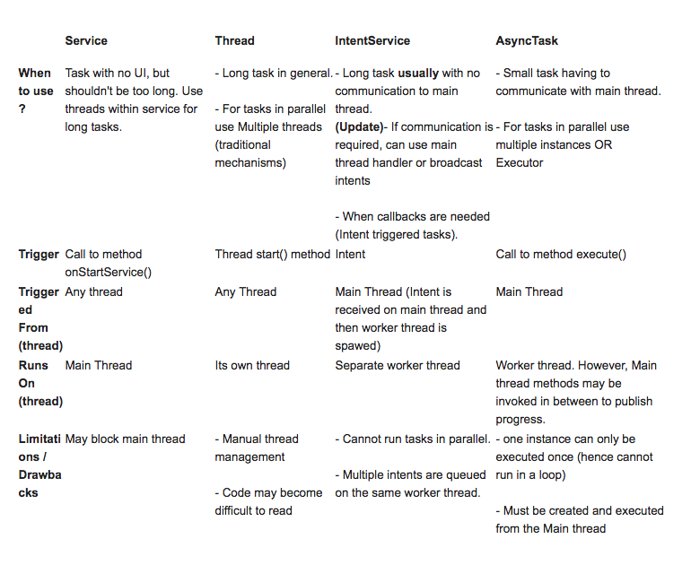

# 🌃 Asenkrona Giriş

## 👀 Asenkron İşlemleri Tanıyalım

* 💫 Ayrı bir Thread üzerinden gerçekleşen bu işlemleri sistemin ilerlemesi engellemez
* 🙋‍♂️ İşleri tamamlandığı zaman UI Thread'e dahil olurlar
* ⭐ **AsyncTask** veya **AsycnTaskLoader** yapıları kullanılır

## 🆚 İkisi Arasındaki Temel Farklar

Her ikisi de sistemi engellemeden çalışan bir yapıya sahiptir

| `AsyncTask` | `AsyncTaskLoader` |
| :--- | :--- |
| Direkt olan çalışır | Dolaylı olarak çalışır |
| Yapılandırma ayarları değiştiğinde iptal olur ve yeniden başlatılır | Yapılandırma ayarlarından etkilenmez |
| Geri dönüş vermeyecek işlemlerde kullanılır | Geri dönüşümlü işlemlerde kullanılır |
| Kısa ve iptal edilebilir işlemlerde tercih edilir | Uzun ve iptal edilemeyecek işlemlerde tercih edilir |

> Telefonu döndürme gibi işlemler yapılandırma ayarlarını değiştirir.


Genel olarak `AsyncTaskLoader` en sık kullanılan yapıdır.


## 🧱 UI Thread

Android üzerindeki tüm görüntü işlemlerinin yapıldı alandır.

* UI Thread engellenmemeli
* UI Thread sadece görsel işlemler için kullanılmalıdır
* Tüm işlemler 16ms'den kısa bir sürede tamamlanmalıdır


Yaklaşık olarak 5s'den uzun süren işlemler  "[application not responding](http://developer.android.com/guide/practices/responsiveness.html)" \(ANR\) diyaloğunu oluşturur ve kullanıcı bunu görmesi durumunda uygulamayı kapatıp, siler 😥


## ⭐ Diğer Asenkron İşlemler

## 🏷️ Etiketleme ile Asenkron

* 👷‍♂️ `@WorkerThread` gibi etiketlerle asenkron çalışması gereken metotlar tanımlanır
* 🦸‍♂️ Kod hakimiyetini artırmak için tercih edilir
* 📢 Thread işlemini otomatik olarak yapmaz, detaylar için [buraya](https://stackoverflow.com/a/33651589/9770490) bakabilirsin


‍🧙‍♂ Detaylı bilgi için [Thread annotations](https://developer.android.com/studio/write/annotations#thread-annotations) alanına bakabilirsin.


## 🎃 Kotlin Coroutine

* 🕊️ Thread işlemlerini kolaylaştıran bir hafif yapıdır
* 👮‍♂️ Main \(UI\), IO, Default thread yapıları ile arka plan işlemlerini yönetirsiniz
* 💁‍♂️ AsyncTask kullanmaya gerek kalmaz
* `implementation 'org.jetbrains.kotlinx:kotlinx-coroutines-android:1.1.1'` ile `build.gradle` dosyasına dahil etmen gerekmektedir

| 🧱 Dispatchers.Main | 🔣 Dispatchers.IO | 🎳 Dispatchers.Default |
| :--- | :--- | :--- |
| UI Thread işlemleri | Disk ve network işlemleri | CPU gerektiren işlemler |
| Fonksiyon çağırma | Database | Liste sıralama |
| View işlemleri | Dosya okuma & yazma | JSON parsing |
| LiveData işlemleri | Ağ işlemleri | DiffUtils |


‍🧙‍♂ Detaylı bilgi için:

* [🌇 Kotlin Coroutine ~ YEmreAk](https://kotlin.yemreak.com/coroutine)
* [📈 Improve app performance with Kotlin coroutines](https://developer.android.com/kotlin/coroutines) 
* [📖 Coroutines on Android \(part I\): Getting the background](https://medium.com/androiddevelopers/coroutines-on-android-part-i-getting-the-background-3e0e54d20bb)
* [🐣 Kotlin Coroutines on Android](https://github.com/kotlin/kotlinx.coroutines/blob/master/README.md#android)

alanlarına bakabilirsin.


## 🔗 Harici Bağlantılar



