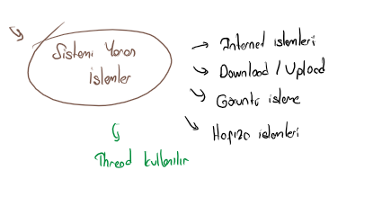

# 🌃 Asenkrona Giriş

## 👀 Asenkron İşlemleri Tanıyalım

* 💫 Ayrı bir Thread üzerinden gerçekleşen bu işlemleri sistemin ilerlemesi engellemez
* 🙋‍♂️ İşleri tamamlandığı zaman UI Thread'e dahil olurlar
* ⭐ **AsyncTask** veya **AsycnTaskLoader** yapıları kullanılır

## 🏷️ Etiketleme ile Asenkron

* 👷‍♂️ `@WorkerThread` gibi etiketlerle asenkron çalışan metotlar tanımlanır


‍🧙‍♂ Detaylı bilgi için [Thread annotations](https://developer.android.com/studio/write/annotations#thread-annotations) alanına bakabilirsin.


## 🆚 İkisi Arasındaki Temel Farklar

Her ikisi de sistemi bloklamadan çalışan bir yapıya sahiptir

| `AsyncTask` | `AsyncTaskLoader` |
| :--- | :--- |
| Direkt olan çalışır | Dolaylı olarak çalışır |
| Yapılandırma ayarları değiştiğinde iptal olur ve yeniden başlatılır | Yapılandırma ayarlarından etkilenmez |
| Geri dönüş vermeyecek işlemlerde kullanılır | Geri dönüşümlü işlemlerde kullanılır |
| Kısa ve iptal edilebilir işlemlerde tercih edilir | Uzun ve iptal edilemeyecek işlemlerde tercih edilir |

> Telefonu döndürme gibi işlemler yapılandırma ayarlarını değiştirir.


Genel olarak `AsyncTaskLoader` en sık kullanılan yapıdır.


## 🧱 UI Thread

Android'teki tüm görüntü işlemlerinin yapıldı alandır.

* UI Thread engellenmemeli
* UI Thread sadece görsel işlemler için kullanılmalıdır
* Tüm işlemler 16ms'den kısa bir sürede tamamlanmalıdır


Yaklaşık olarak 5s'den uzun süren işlemler  "[application not responding](http://developer.android.com/guide/practices/responsiveness.html)" \(ANR\) diyaloğunu oluşturur ve kullanıcı bunu görmesi durumunda uygulamayı kapatıp, siler 😥


## 🔗 Harici Bağlantılar



