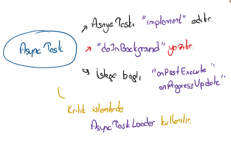

# 🔁 AsyncTask

## 🎈 Ne için Kullanılır

* 🕊️ Verilen işlemi arka planda, sistemi işlerini engellemeden tamamlar.
* 🐞 Yapılandırma ayarlarından etkilenir, işlem yok edilip yeniden başlatılır
  * 💫 Telefonu döndürme vs gibi işlemler yapılandırma ayarlarını değiştirir
  * 🗑️ Aynı işlemin çokça yapılması RAM tüketimini arttırır
* 🌃 Uygulama kapatıldığında `cancel()` metodu çalıştırılmadığı sürece çalışmaya devam eder


Önemli ve kritik işlemler için `AsyncTaskLoader` tercih edilir


## 🐣 Kullanım Metotları


| 💠 Metot | 📜 Açıklama |
| :--- | :--- |
| `onPreExecute()` | İşlem tamamlanmadan önce ara ara çağrılan metottur, genellikle % dolum bilgisi vermek için kullanılır |
| `doInBackground(Params...)` | `onPreExecute()` metodu bittiği an çalışır, arkaplan işlemlerini yapan kısımdır. `publishProgress()` metodu ile değişikleri UI Thread'e aktarır. Bittiğinde `onPostExecure()` metoduna sonucu aktarır. |
| `onProgressUpdate(Progress...)` | `publishProgress()` metodundan sonra çalışır, genellikle raporlama veye ilerleme adımlarını kullanıcıya göstermek için kullanılır |
| `onPostExecute(Result)` | Arkaplan işlemi tamamlandığında sonuç buraya aktarılır, UI Thread bu metot üzerinden sonucu kullanır. |


`onProgressUpdate` metodunda tüm adımları ele alırsanız, asenkron çalışma yapısı bozulur ve senkronize olarak çalışır


## 🧱 Prototip



```java
public class MyAsyncTask extends AsyncTask <String, Void, Bitmap>{}
```

* 🏹`String` değişkeni, `doInBackground` metoduna aktarılacak verilerdir 
* 🌌`Void` yapısı, `publishProgress` ve `onProgressUpdate` metotlarının kullanılmayacağını belirtir
* 🔸`Bitmap` tipi de, `onPostExecute` ile aktarılan işlem sonucunun tipini belirtir



Son iki parametre \(`Void` ve `Bitmap`\) dışarıdan verilmez, sınıf içi parametrelerdir


## ❌ İşlemi İptal Etme

* 🚫 İşlemi istediğin zaman  [`cancel()`](https://developer.android.com/reference/android/os/AsyncTask.html#cancel%28boolean%29) metodu ile iptal edebilirsin
* 🔙 [`cancel()`](https://developer.android.com/reference/android/os/AsyncTask.html#cancel%28boolean%29) metodu işlem tamamlanmışsa `False` döndürür
  * 🙄 Biten işlemi iptal edemezsin
* 👮‍♂️ İşlemin iptal edilme durumunu `doInBackground` metodunda `isCancalled()` metodu kontrol etmemiz gerekmektedir
* ❣️ İşlem iptal edildiğin `doInBackground` metodundan sonra `onPostExecute` yerine  [`onCancelled(Object)`](https://developer.android.com/reference/android/os/AsyncTask.html#onCancelled%28Result%29) metodu döndürülür


Varsayılan olarak [`onCancelled(Object)`](https://developer.android.com/reference/android/os/AsyncTask.html#onCancelled%28Result%29) metodu `onCancelled()` metodunu çağırır, sonuç görmezden gelinir.


## 👨‍💻 Kod

```java
private class DownloadFilesTask extends AsyncTask<URL, Integer, Long> {
     protected Long doInBackground(URL... urls) {
         int count = urls.length;
         long totalSize = 0;
         for (int i = 0; i < count; i++) {
             totalSize += Downloader.downloadFile(urls[i]);
             publishProgress((int) ((i / (float) count) * 100));
             // Escape early if cancel() is called
             if (isCancelled()) break;
         }
         return totalSize;
     }

     protected void onProgressUpdate(Integer... progress) {
         // 0. eleman en son adımı belirtir. (FIFO)
         setProgressPercent(progress[0]);
     }

     protected void onPostExecute(Long result) {
         showDialog("Downloaded " + result + " bytes");
     }
 }
 
 // UI Thread'te kullanımı
 new DownloadFilesTask().execute(url1, url2, url3);
```

