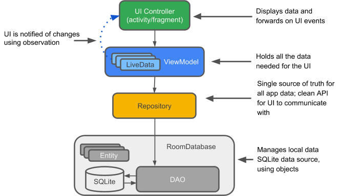
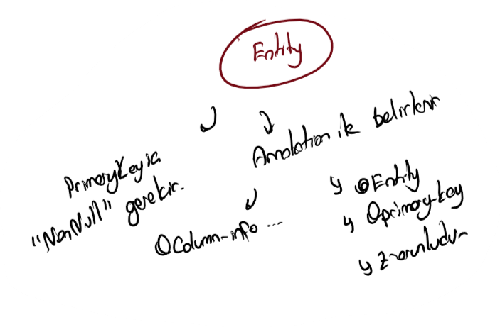

# 💽 Room Database

## 🚴‍♂️ RoomDB'ye Giriş

* 🤓 SQL komutları ile uğraşmadan direkt android kodları ile çalışmamızı sağlar
* ✨ Optimize edilmiş bir veri tabanı sunar \(`LiveData`\)
* 💨 Kotlin Flow yapısı ile RoomDB oluşturabilir \(👨‍🔬 _Deneysel_\)

> 🚀 Faydalı bağlantılara sayfanın en altından erişebilirsin


📢 Java örneği ile Kotlin örneği birbirinden bağımsızdır


## 🏗️ Projeye Dahil Etme

* 🔄 Güncel RoomDB sürümüne [Versions](https://developer.android.com/jetpack/androidx/releases/room#version_223_3) alanından erişebilirsin
* ➕ RoomDB için Kotlin eklentilerine [Room KTX](https://developer.android.com/kotlin/ktx#room) alanından erişebilirsin



```groovy
dependencies {
	// RoomDB
	implementation "androidx.work:work-runtime-ktx:2.3.0"
	implementation "androidx.room:room-ktx:2.2.3"
	kapt "androidx.room:room-compiler:2.2.3"
	androidTestImplementation "androidx.room:room-testing:2.2.3"
	
	// Lifecycle
	implementation "androidx.lifecycle:lifecycle-extensions:2.2.0"
	kapt "androidx.lifecycle:lifecycle-compiler:2.2.0"
	androidTestImplementation "androidx.arch.core:core-testing:2.1.0"

	// ViewModel
	implementation 'androidx.lifecycle:lifecycle-viewmodel-ktx:2.2.0'
	
	// Livedata - Kotlin Flow
	implementation 'androidx.lifecycle:lifecycle-livedata-ktx:2.2.0'
}
```



```java
dependencies {
  def room_version = "2.2.3"

  implementation "androidx.room:room-runtime:$room_version"
  annotationProcessor "androidx.room:room-compiler:$room_version"
}
```




‍🧙‍♂ Detaylar için [Declaring dependencies](https://developer.android.com/jetpack/androidx/releases/room#declaring_dependencies) alanına bakabilirsin.


## 🧱 Temel Yapı



## ⭐ Entity Yapısı

* 🧱 DB'ye aktarılacak sütun isimlerini temsil ederler
* 🏷️ [Annotation](https://www.geeksforgeeks.org/annotations-in-java/) yapısı ile özellikleri belirlenir
* 🔸 Tablodaki sütün isimleri entity üzerindeki değişkenlerle temsil edilir
* 👮‍♂️ **Primary key** ve **Entity** etiketini eklemek zorunludur





```kotlin
package com.yemreak.depremya.db.entity

import androidx.room.ColumnInfo
import androidx.room.Entity
import androidx.room.Ignore
import androidx.room.PrimaryKey
import com.yemreak.depremya.db.entity.Quake.Companion.TABLE_NAME

/**
 * Deprem bilgileri
 * @see <a href="http://www.koeri.boun.edu.tr/scripts/lst0.asp">
 *     Son depremler `~ Kandilli Rasathanesi
 * </a>
 */
@Entity(tableName = TABLE_NAME)
data class Quake(
	@ColumnInfo(name = COLUMN_ID) @PrimaryKey(autoGenerate = true) val id: Int,
	@ColumnInfo(name = COLUMN_DATE) val date: String,
	@ColumnInfo(name = COLUMN_HOUR) val hour: String,
	@ColumnInfo(name = COLUMN_LAT) val lat: String,
	@ColumnInfo(name = COLUMN_LNG) val lng: String,
	@ColumnInfo(name = COLUMN_DEPTH) val depth: String,
	@ColumnInfo(name = COLUMN_MD) val md: String,
	@ColumnInfo(name = COLUMN_ML) val ml: String,
	@ColumnInfo(name = COLUMN_MW) val mw: String,
	@ColumnInfo(name = COLUMN_CITY) val city: String,
	@ColumnInfo(name = COLUMN_REGION) val region: String,
	@ColumnInfo(name = COLUMN_RESOLUTION) val resolution: String
) {
	
	companion object {
		
		const val TABLE_NAME = "quake"
		const val COLUMN_ID = "id"
		const val COLUMN_DATE = "date"
		const val COLUMN_HOUR = "hour"
		const val COLUMN_LAT = "lat"
		const val COLUMN_LNG = "lng"
		const val COLUMN_DEPTH = "depth"
		const val COLUMN_MD = "md"
		const val COLUMN_ML = "ml"
		const val COLUMN_MW = "mw"
		const val COLUMN_CITY = "city"
		const val COLUMN_REGION = "region"
		const val COLUMN_RESOLUTION = "resolution"
		
	}
	
	@Ignore
	override fun equals(other: Any?): Boolean {
		if (this === other) return true
		if (javaClass != other?.javaClass) return false
		
		other as Quake
		
		if (date != other.date) return false
		if (hour != other.hour) return false
		if (lat != other.lat) return false
		if (lng != other.lng) return false
		if (depth != other.depth) return false
		if (md != other.md) return false
		if (ml != other.ml) return false
		if (mw != other.mw) return false
		if (city != other.city) return false
		if (region != other.region) return false
		if (resolution != other.resolution) return false
		
		return true
	}

}

```



```java
@Entity(tableName = "word_table")
public class Word {
    @PrimaryKey (autoGenerate=true)
    private int wid;

    @ColumnInfo(name = "first_word")
    private String firstWord;

    @ColumnInfo(name = "last_word")
    private String lastWord;

    // Getters and setters are not shown for brevity,
    // but they're required for Room to work if variables are private.
}

```




👀 Daha fazlası için [Entity](https://google-developer-training.github.io/android-developer-fundamentals-course-concepts-v2/unit-4-saving-user-data/lesson-10-storing-data-with-room/10-1-c-room-livedata-viewmodel/10-1-c-room-livedata-viewmodel.html#entity) ve [Defining data using Room entities](https://developer.android.com/training/data-storage/room/defining-data.html) dokümanlarına bakabilirsin.


### 👀 Entity Hakkında Bir Kaç Detay

*  💡 SQL yapısında veriler 64 bit olduğundan:
* 🧮 32bit long değeri 64bit int değerine eş değerdir
* 🔄 `id` değerlerini **long** olarak tutsanız da android onu **int** olarak tanımlanacaktır
* 🏹 Veri tabanına eklenen verilerin `id` bilgileri **long** olarak döndürülür


‍🧙‍♂ Detaylı bilgiler için bağlantılar:

* [Primary Key in Room should be int or long?](https://stackoverflow.com/questions/55994734/primary-keys-in-room-should-be-int-or-long)
* [Android Room - Get the id of new inserted row with auto-generate](https://stackoverflow.com/a/44364516/9770490)


## 🛳️ DAO Yapısı

* 🐣 Tablolara erişmek için kullanılan yapıdır
* 🧱 Abstract veya Interface olmak zorundadır
* 🏷️ SQLite query metinleri metotlara Annotation yapısı ile tanımlanır
* ✨ LiveData yapısı ile güncel verileri döndürür


📢 SQLite ile SQL Server syntax yapısı [buradaki](https://stackoverflow.com/questions/51553855/delete-data-in-room-using-inner-join) kaynağa göre farklı olabilmekte





```kotlin
package com.yemreak.depremya.db.dao

import androidx.room.Dao
import androidx.room.Insert
import androidx.room.Query
import com.yemreak.depremya.db.entity.Quake
import kotlinx.coroutines.flow.Flow


@Dao
abstract class QuakeDao {
	
	@Insert
	abstract suspend fun insertAll(quakes: Array<out Quake>)
	
	@Query("SELECT * FROM ${Quake.TABLE_NAME}")
	abstract fun getAll(): Flow<List<Quake>>
	
	@Query("SELECT * FROM ${Quake.TABLE_NAME} WHERE ${Quake.COLUMN_MD} > :md")
	abstract fun getAllHigherMd(md: Float): Flow<List<Quake>>
	
	@Query("DELETE FROM ${Quake.TABLE_NAME}")
	abstract suspend fun deleteAll()
	
}

```



```java
@Dao
public interface WordDao {

   // The conflict strategy defines what happens, 
   // if there is an existing entry.
   // The default action is ABORT. 
   @Insert(onConflict = OnConflictStrategy.REPLACE)
   void insert(Word word);

   // Update multiple entries with one call.
   @Update
   public void updateWords(Word... words);

   // Simple query that does not take parameters and returns nothing.
   @Query("DELETE FROM word_table")
   void deleteAll();

   // Simple query without parameters that returns values.
   @Query("SELECT * from word_table ORDER BY word ASC")
   List<Word> getAllWords();

   // Query with parameter that returns a specific word or words.
   @Query("SELECT * FROM word_table WHERE word LIKE :word ")
   public List<Word> findWord(String word);
}
```




👀 Daha fazlası için [The DAO \(data access object\)](https://google-developer-training.github.io/android-developer-fundamentals-course-concepts-v2/unit-4-saving-user-data/lesson-10-storing-data-with-room/10-1-c-room-livedata-viewmodel/10-1-c-room-livedata-viewmodel.html#dao) dokümanına bakabilirsin.


## 🗂️ Room Database

* 🧱 Abstract olmak zorundadır
* 🏗️ `Room.databaseBuilder(...)` yapısı ile db tanımlanır
* 🏷️ Database etiketi içerisinde
  *  `entities`alanında tablo verilerini temsil eden Entity Class'ınızın objesi verilir
  *  `version` alanında db'nin en son sürümünü belirtin
  * 🐛 Versiyon geçişleri arasındaki sorunları engellemek için `fallbackToDestructiveMigration()` özelliği eklenir




```kotlin
package com.yemreak.depremya.db

import android.content.Context
import androidx.room.Database
import androidx.room.Room
import androidx.room.RoomDatabase
import com.yemreak.depremya.db.dao.QuakeDao
import com.yemreak.depremya.db.entity.Quake

@Database(entities = [Quake::class], version = 1, exportSchema = false)
abstract class QuakeRoom : RoomDatabase() {
	
	companion object {
		
		const val DB_NAME = "quake_db"
		
		/**
		 * Singleton yapısı ile birden fazla örneğin oluşmasını engelleme
		 */
		@Volatile
		private var INSTANCE: QuakeRoom? = null
		
		fun getDatabase(context: Context): QuakeRoom {
			return when (val tempInstance = INSTANCE) {
				null -> synchronized(this) {
					val instance = Room.databaseBuilder(
						context,
						QuakeRoom::class.java,
						DB_NAME
					).fallbackToDestructiveMigration().build()
					INSTANCE = instance
					
					return instance
				}
				else -> tempInstance
			}
		}
	}
	
	abstract fun quakeDao(): QuakeDao
}

```



```java
@Database(entities = {Word.class}, version = 1)
public abstract class WordRoomDatabase extends RoomDatabase {

   public abstract WordDao wordDao();

   private static WordRoomDatabase INSTANCE;

   static WordRoomDatabase getDatabase(final Context context) {
       if (INSTANCE == null) {
           synchronized (WordRoomDatabase.class) {
               if (INSTANCE == null) {
                   INSTANCE = Room.databaseBuilder(context.getApplicationContext(),
                           WordRoomDatabase.class, "word_database")
                             // Wipes and rebuilds instead of migrating 
                             // if no Migration object.
                           .fallbackToDestructiveMigration()
                           .build();                
               }
           }
       }
       return INSTANCE;
   }
}
```




👀 Daha fazlası için [Room database](https://google-developer-training.github.io/android-developer-fundamentals-course-concepts-v2/unit-4-saving-user-data/lesson-10-storing-data-with-room/10-1-c-room-livedata-viewmodel/10-1-c-room-livedata-viewmodel.html#room) dokümanına bakabilirsin.


### 👮‍♂️ DB'yi Koruma

* ‍🚫 Veri tabanına birden çok istek gelmesini engeller
* 🐞 Birden çok isteğin eş zamanlı yapılmaya çalışması **conflict** oluşturacaktır
* 💔 Conflict yapısı veri tabanındaki verilerin uyuşmazlığını belirtir
*  Birden fazla Thread gelmesi durumunda engellemek için **synchronized** anahtar kelimesi kullanılır
* ✨ Gereksiz Thread engelinden sakınmak için, synchronized yapısı içerisinde tekrardan **if kontrolü** yapılmalıdır



👀 Detaylar için [Multi-threading](../arkaplan/multithreading.md) alanına bakabilirsin.


## 🏗️ Repository Yapısı

* 🌃 Alt katmanda olan tüm sınıfları tek bir sınıfmış gibi gösterir
  * 😏 Bu sayede **ViewModel** üzerinden birden fazla sınıfla uğraşmak zorunda kalmayız
  * 🚧 DB üzerinde yapılacak olan tüm işlemlerinde burada metot olarak tanımlanması lazımdır
* ✨ **LiveData** yapısı sayesinde verileri otomatik günceller
  * 🦄 Verilerin aktarımı bir defaya mahsus **Constructor** üzerinde yapılır
* 🌠 Verilerin aktarılması **asenkron** olması gerektiğinden [AsyncTask](../arkaplan/asynctask-ve-asynctaskloader/) yapısı kullanılır




```kotlin
package com.yemreak.depremya

import com.yemreak.depremya.db.dao.QuakeDao
import com.yemreak.depremya.db.entity.Quake
import kotlinx.coroutines.flow.Flow

class QuakeRepository(private val quakeDao: QuakeDao) {
	
	val allQuakes: Flow<List<Quake>> = quakeDao.getAll()
	
	suspend fun insert(quakes: Array<out Quake>) {
		quakeDao.insertAll(quakes)
	}
	
	suspend fun deleteAll() {
		quakeDao.deleteAll()
	}
	
}

```



```java
public class WordRepository {

   private WordDao mWordDao;
   private LiveData<List<Word>> mAllWords;

   WordRepository(Application application) {
       WordRoomDatabase db = WordRoomDatabase.getDatabase(application);
       mWordDao = db.wordDao();
       mAllWords = mWordDao.getAllWords();
   }

   LiveData<List<Word>> getAllWords() {
       return mAllWords;
   }

   public void insert (Word word) {
       new insertAsyncTask(mWordDao).execute(word);
   }

   private static class insertAsyncTask extends AsyncTask<Word, Void, Void> {

       private WordDao mAsyncTaskDao;

       insertAsyncTask(WordDao dao) {
           mAsyncTaskDao = dao;
       }

       @Override
       protected Void doInBackground(final Word... words) {
           for (Word word : words) {
               mAsyncTaskDao.insert(word);
           }
       
           return null;
       }
   }
}
```



## 🛍️ ViewModel

* 🧱 Yapılandırma değişikliklerine karşı dayanıklıdır
* 🐣 Repository ile DB'ye erişir
* 🎳 Activity context objesi gönderilmez, çok maliyetlidir
* 🥚  Context verisi miras alınmalıdır
* 📝 UI ile alakalı bilgilerin kaydı ile uğraşır




```kotlin
package com.yemreak.depremya.viewmodel

import android.app.Application
import androidx.lifecycle.AndroidViewModel
import androidx.lifecycle.LiveData
import androidx.lifecycle.asLiveData
import androidx.lifecycle.viewModelScope
import com.yemreak.depremya.QuakeRepository
import com.yemreak.depremya.db.QuakeRoom
import com.yemreak.depremya.db.entity.Quake
import kotlinx.coroutines.launch

class QuakeViewModel(application: Application) : AndroidViewModel(application) {
	
	private val repository: QuakeRepository
	
	val allQuakes: LiveData<List<Quake>>
	
	init {
		val quakeDao = QuakeRoom.getDatabase(application.applicationContext).quakeDao()
		repository = QuakeRepository(quakeDao)
		allQuakes = repository.allQuakes.asLiveData()
	}
	
	// UI threadi bloklamadan çalışır (viewModelScope)
	fun refreshQuakes(quakes: List<Quake>) = viewModelScope.launch {
		repository.deleteAll()
		repository.insert(quakes.toTypedArray())
	}
}

```



```java
public class WordViewModel extends AndroidViewModel {

   private WordRepository mRepository;

   private LiveData<List<Word>> mAllWords;

   public WordViewModel (Application application) {
       super(application);
       mRepository = new WordRepository(application);
       mAllWords = mRepository.getAllWords();
   }

   LiveData<List<Word>> getAllWords() { return mAllWords; }

   public void insert(Word word) { mRepository.insert(word); }
}
```



## ✨ LiveData

* 🔄 Verileri güncel tutmak için kullanılır
* 📈 Performansı artırır
* 🧱 Yapılandırma değişikliklerine karşı dayanıklıdır
  * 📳 Telefonu çevirme vs.
* 🍱 Tüm katmanlardaki metotlar kapsüllenmelidir
  * [🗃️ Repository](room-database.md#repository-yapisi)
  * [🛳️ DAO](room-database.md#dao-yapisi)
  * [🛍️ ViewHolder](room-database.md#viewholder)


## 🚀 Main Activity



```kotlin
class MainActivity : AppCompatActivity() {
	
	private var quakes: List<Quake> = emptyList()
	private var selectedMag: Int = 0
	
	private lateinit var quakeViewModel: QuakeViewModel
	
	override fun onCreate(savedInstanceState: Bundle?) {
		super.onCreate(savedInstanceState)
		
		setContentView(R.layout.activity_main)
		// ...
		
		quakeViewModel = ViewModelProvider(this).get(QuakeViewModel::class.java)
		quakeViewModel.allQuakes.observe(this, Observer {
			it?.let {
				quakes = it
				/*
				// Varsa recycleview objesine aktarılır
				(quake_recycler_view.adapter as QuakeAdapter).setQuakesAndNotify(quakes)
				*/
			}
		})
		
		/*
		// İsteğe bağlı refresh layout kullanımı
		quake_refresh_layout.setOnRefreshListener {
			// ...
			quake_refresh_layout.isRefreshing = false
		}
		*/
		
	}
	
	//...
	
}

```



```java
wordsViewModel.getAllNews().observe(
    this,
    words -> fillView(new ArrayList<>(news))
);

private void fillView(ArrayList<Words> words) {
    // XML layoutu üzerinden tanımlanması lazımdır
    RecyclerView recyclerView = findViewById(R.id.rv_words);
    
    // Class olarak tanımlanması lazımdır
    WordsAdapter wordsAdapter = new WordsAdapter(this, words);
    
    recyclerView.setAdapter(wordsAdapter);
    recyclerView.setLayoutManager(new LinearLayoutManager(this));
}
```




‍🧙‍♂ Detaylar için [RecycleView](https://developer.android.com/guide/topics/ui/layout/recyclerview) alanına bakabilirsiniz.


## 🔗 Faydalı Bağlantılar


🚀 Bu bağlantıların hepsi [YEmoji](https://emoji.yemreak.com/kullanim/baglantilar) yapısına uygundur


### 🎃 Kotlin

* [👨‍🏫 Android Room with View](https://codelabs.developers.google.com/codelabs/android-room-with-a-view-kotlin/#0)
* [👨‍🏫 Advanced Coroutines with Kotlin Flow and LiveData](https://codelabs.developers.google.com/codelabs/advanced-kotlin-coroutines)
* [📖 Room KTX](https://developer.android.com/kotlin/ktx#room)

### ☕ Java

* 👨‍🏫 [Android Room with a View - Java](https://codelabs.developers.google.com/codelabs/android-room-with-a-view/#0)
* [👨‍🏫 Save data in a local database using Room ~Training](https://developer.android.com/training/data-storage/room)
* 📖 [Room, LiveData and ViewModel](https://google-developer-training.github.io/android-developer-fundamentals-course-concepts-v2/unit-4-saving-user-data/lesson-10-storing-data-with-room/10-1-c-room-livedata-viewmodel/10-1-c-room-livedata-viewmodel.html)
* [📖 Accessing data using Room DAOs](https://developer.android.com/training/data-storage/room/accessing-data)
* [📖 Android, RecycleView](https://developer.android.com/guide/topics/ui/layout/recyclerview)

