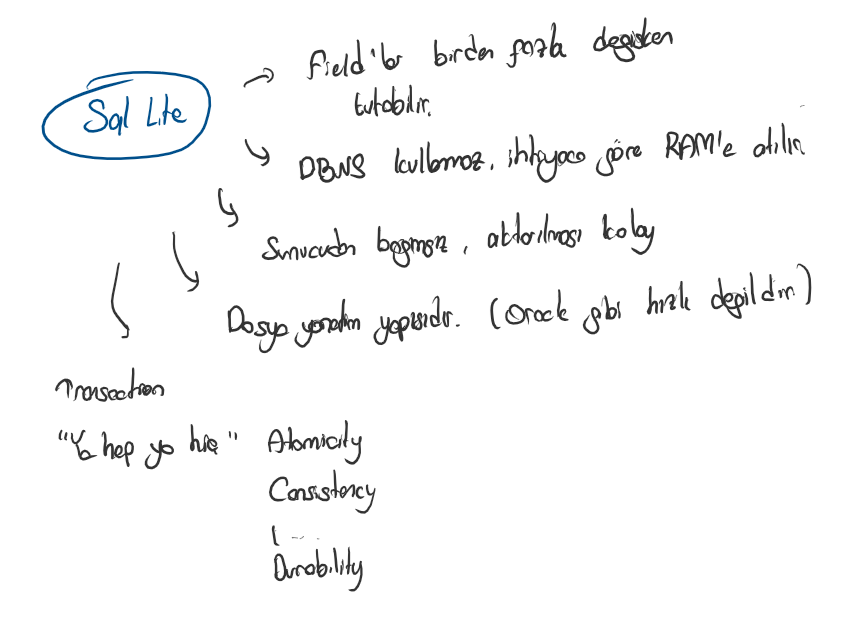

# 🗃️ SQLite

## ✍ Yazılı Notlarım



## 🧱 Temel İşlemler

İlk olarak try - catch yapısı kurulur ve olası sorunda programın kapanması engellenir.

```text
try {
    ...
}
catch (e : Exception){
    e.printStackTrace()
}
```

> Bütün kodları `...` olan yere yazacağız. Artık başlayabiliriz.

## 🏗️ Basit DB Oluşturma

`database = openOrCreateDatabase("Datas", Context.MODE_PRIVATE, null)`

* "Datas" : Oluştumak istediğimiz database'in adı \("Veriler", "Hey", "hop" vb.\)
  * Yazım kuralları gereği database adı büyük harfle başlamalı
* Context.MODE\_PRİVATE : Database'i private \(özel\) sadece bizim erişebileceğimiz halde kurmak.
  * \(Context.MODE yazıp ALT+ SPACE yaparsanız detaylar çıkacaktır karşınıza\)
* null : CursorFactory

## 👨‍💻 DB Oluşturma Kodları

```text
try {
    val database = openOrCreateDatabase("Datas", Context.MODE_PRIVATE, null)

    database.execSQL("CREATE TABLE IF NOT EXIST datas (name VARCHAR, age INT(2)")
// INT(2) ile 2 rakam olacağını belli ediyoruz
} catch (e : Exception){
    e.printStackTrace()
}
```

* `CREATE TABLE IF NOT EXITS` table oluşturma
* `datas` table ismi
* `VARCHAR` char
* `INT` Int

## 👨‍🔧 DB İşlemleri Değiştirme

Temel yapısı `database.execSQL("...")` şeklindedir.

```text
database.execSQL("INSERT INTO datas (name, age) VALUES ('Yunus' , 21)") // Veri Ekleme
database.execSQL("INSEER INTO datas (name, age) VALUES ('Emre', 15") // Veri Ekleme
database.execSQL("UPDATE datas SET age = 21 WHERE name = 'Yunus") // Veri güncelleme
database.execSQL("DELETE FROM datas WHERE age = 15") // Veri silme
database.execSQL("SELECT FROM datas WHERE name = 'Yunus") // Yunus isimli olan dataları alır
database.execSQL("SELECT FROM datas WHERE name LIKE '%s'") // sonunda 's' harfi olanları alır
database.execSQL("SELECT FROM datas WHERE name LIKE 'y%") // başında 'y' harfi olanları alır
database.execSQL("SELECT FROM datas WHERE name LIKE '%u%") // içinde 'u' harfi olanları alır
```

* `INSERT INTO` Veri ekleme için SQL kodu
* `UPDATE` Veri güncelleme
* `SELECT` Veri seçme
* `datas` table ismi
* `name` değişken ismi
* `age` değişken ismi
* `VALUES` değerleri atamak için SQL kodu
* `'Yunus'` VARCHAR \(string\) tipindeki veri
* `21` INT\(2\) \(Int\) tipindeki veri

## 👀 DB Okuma

```text
if (database != null) {
    val cursor = database!!.rawQuery("SELECT * FROM datas", null)

    val nameIndex = cursor.getColumnIndex("name")
    val ageIndex = cursor.getColumnIndex("age")

    cursor.moveToFirst()

    while (cursor != null){
        println("İsim : ${cursor.getString(nameIndex)}" )
        println("Yaş : ${cursor.getString(ageIndex)}")

        cursor.moveToNext()
    }
}
```

* `rawQuery(...)` SQL kodu ile veri alma
* `SELECT * FROM` Bütün verileri almak için SQL kodu
* `nameIndex` name sütünundaki verilerin indexi
* `ageIndex` age sütunundaki verilerin indexi
* `Cursor.moveToFirst()` Cursoru ilk elemana atıyoruz
* `Cursor.getString()` İstenen indexteki string olarak döndürür.
* `Cursor.moveToNext()` cursoru bir sütün aşağı indirme

