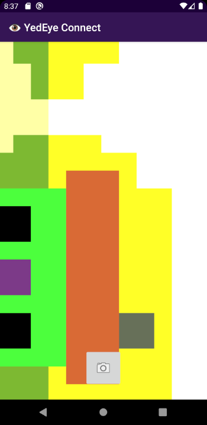
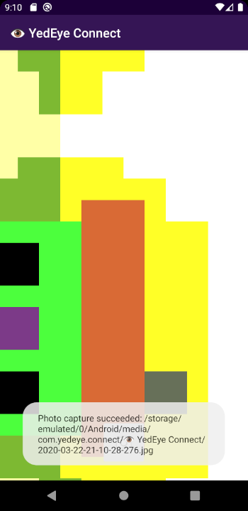

# 📸 CameraX Kullanımı

## 📦 Bağımlılıkları Dahil Etme

* ➕ Projenizin `build.gradle` dosyasındaki `dependencies` alanına alttaki `implementation` bilgilerini ekleyin
* 📢 CameraX, **java 8** kütüphanelerini de kullandığı için `compileOptions` da eklenmelidir


```groovy

compileOptions {
    sourceCompatibility JavaVersion.VERSION_1_8
    targetCompatibility JavaVersion.VERSION_1_8
}

dependencies {

	// ...
		
	implementation "androidx.camera:camera-camera2:1.0.0-beta01"
	implementation "androidx.camera:camera-core:1.0.0-beta01"
	implementation "androidx.camera:camera-extensions:1.0.0-alpha08"
	implementation "androidx.camera:camera-lifecycle:1.0.0-beta01"
	implementation "androidx.camera:camera-view:1.0.0-alpha08"		
}
```



‍🧙‍♂ Detaylı bilgi için [Add the Gradle dependencies](https://codelabs.developers.google.com/codelabs/camerax-getting-started/#2) alanına bakabilirsin.


## 📃 CameraX XML Kodları

* 👮‍♂️ Buradaki XML kodları, Activity java sınıfının temsil ettiği layout dosyasına yazılmalıdır
* 😥 Android layout editörü `PreviewView`'i henüz desteklememektedir, IDE görsel çıktı sunmaz
* 💁‍♂️ Ama çalışır
* ⭐ Alttaki fotoğrafta XML'in temsil ettiği çıktı gösterilmiştir


```markup
<?xml version="1.0" encoding="utf-8"?>
<androidx.constraintlayout.widget.ConstraintLayout xmlns:android="http://schemas.android.com/apk/res/android"
	xmlns:app="http://schemas.android.com/apk/res-auto"
	xmlns:tools="http://schemas.android.com/tools"
	android:layout_width="match_parent"
	android:layout_height="match_parent"
	tools:context=".CameraXActivity">
	
	<androidx.camera.view.PreviewView
		android:id="@+id/pvCameraX"
		android:layout_width="match_parent"
		android:layout_height="match_parent"
		app:layout_constraintBottom_toBottomOf="parent"
		app:layout_constraintEnd_toEndOf="parent"
		app:layout_constraintStart_toStartOf="parent"
		app:layout_constraintTop_toTopOf="parent" />
	
	<ImageButton
		android:id="@+id/ibTakePicture"
		android:layout_width="72dp"
		android:layout_height="72dp"
		android:layout_margin="24dp"
		android:contentDescription="Take picture"
		app:layout_constraintBottom_toBottomOf="parent"
		app:layout_constraintEnd_toEndOf="parent"
		app:layout_constraintStart_toStartOf="parent"
		app:srcCompat="@android:drawable/ic_menu_camera" />


</androidx.constraintlayout.widget.ConstraintLayout>

```





‍🧙‍♂ Detaylı bilgi için [Create the viewfinder layout](https://codelabs.developers.google.com/codelabs/camerax-getting-started/#3) alanına bakabilirsin.


## 👮‍♂️ Gerekli İzinlerin Alınması

### 📜 Manifest izinlerini alma

* 😅 Kamera ile çalışacağımızdan, haliyle kamera iznine ihtiyacımız olacaktır
* 📜 Android manifest dosyanıza alttaki izin satırını ekleyin

```markup
<?xml version="1.0" encoding="utf-8"?>
<manifest xmlns:android="http://schemas.android.com/apk/res/android"
	package="com.yemreak.example">
	
	<uses-permission android:name="android.permission.CAMERA" /> 
	
	<!-- application alanı -->
</manifest>

```

### 👮‍♂️ Uygulama içinden izin isteme

```kotlin
class CameraXActivity : AppCompatActivity() {

    // Çok fazla istek olursa, isteklerin karışmasını engellemek için kullanılır
    private const val REQUEST_CODE_PERMISSIONS = 10
    
    // Kamera için gereken izinler
    private val REQUIRED_PERMISSIONS = arrayOf(Manifest.permission.CAMERA)

    override fun onCreate(savedInstanceState: Bundle?) {
        // ...
        
        
        // Kamera izinleri alındysa işlemleri yapma
        if (allPermissionsGranted()) {
            // Layouta kamerayı ekleme
            pvCameraX.post { startCamera() }
        } else {
            ActivityCompat.requestPermissions(
                this, REQUIRED_PERMISSIONS, REQUEST_CODE_PERMISSIONS)
        }
    }
    
    /**
     * İzin alındıysa aktiviteyi açma ve preview'i başlatma
     * İzin alınmadıysa bildirim gösterip, activityi kapatma
     */
    override fun onRequestPermissionsResult(
        requestCode: Int, permissions: Array<String>, grantResults: IntArray) {
        if (requestCode == REQUEST_CODE_PERMISSIONS) {
            if (allPermissionsGranted()) {
                viewFinder.post { startCamera() }
            } else {
                Toast.makeText(this,
                    "Permissions not granted by the user.", 
                    Toast.LENGTH_SHORT).show()
                finish()
            }
        }
    }
    
    /**
     * Kamera için gereken tüm izinleri kontrol etme
     */
    private fun allPermissionsGranted() = REQUIRED_PERMISSIONS.all {
        ContextCompat.checkSelfPermission(
               baseContext, it) == PackageManager.PERMISSION_GRANTED
    }
    
    private fun startCamera() {
        // TODO: CameraX işlemleri eklenecek
    }
    
}


```


‍🧙‍♂ Detaylı bilgi için[ Request camera permissions](https://codelabs.developers.google.com/codelabs/camerax-getting-started/#4) alanına bakabilirsin.


## 👀 CameraX Ön İzlemesi

* 📸 Alttaki kod ile kameraya gelen görüntüyü ekrana basacağız
* 👮‍♂️ `cameraProviderFuture.get()` ile kameranın  olduğundan emin oluyoruz
* 🎳 `PreviewView.ImplementationMode.TEXTURE_VIEW` animasyonları ve dönüşümleri destekler, daha fazla memory kullanır
* 🕊️ `PreviewView.ImplementationMode.SURFACE_VIEW` daha hızlı ve basit çalışan bir yapıdır

```kotlin
class CameraXActivity : AppCompatActivity() {
	
	private lateinit var cameraProviderFuture: 
		ListenableFuture<ProcessCameraProvider>
	
	// ...
	
	/**
	 * Initialize CameraX provider
	 */
	private fun startCamera() {
		cameraProviderFuture = ProcessCameraProvider.getInstance(this)
		
		cameraProviderFuture.addListener(Runnable {
			// Kamera sağlayıcı ile kameranın aktif olduğundan emin oluyoruz
			val cameraProvider = cameraProviderFuture.get()
			
			// Daha kullanışlı ama daha çok memory harcar
			// https://stackoverflow.com/a/28620918
			pvCameraX.implementationMode = PreviewView.ImplementationMode.TEXTURE_VIEW
			
			// Kamera ön izlemesini tanımlama
			val cameraPreview = Preview.Builder().apply {
				setTargetRotation(pvCameraX.display.rotation)
				setTargetAspectRatio(AspectRatio.RATIO_16_9)
				setTargetName("Preview")
			}.build().apply { setSurfaceProvider(pvCameraX.previewSurfaceProvider) }
			
			// Ön-arka kamera seçimini yapıyoruz
			val cameraSelector = CameraSelector.Builder()
				.requireLensFacing(CameraSelector.LENS_FACING_BACK)
				.build()
			
			// Kamera kullanım durumlarını kameranın yaşam döngüsüne dahil ediyoruz
			val camera = cameraProvider.bindToLifecycle(
				this as LifecycleOwner, cameraSelector, cameraPreview
			)
			
		}, ContextCompat.getMainExecutor(this))
	}
	
}
```


‍🧙‍♂ Detaylı bilgi için 

* [Android CameraX](https://proandroiddev.com/update-android-camerax-4a44c3e4cdcc) 
* [SurfaceView vs TextureView for Camera?](https://stackoverflow.com/questions/27225242/surfaceview-vs-textureview-for-camera)

alanlarına bakabilirsin.


## 📸 Resim Çekme Özelliği Ekleme

* ✨ `ImageCapture` objesi oluşturup, onu kameramıza dahil edeceğiz
* 💠 Resmin alındığı metodu `takePicture` olarak tanımlayacağız
* 💫 Daha önceden XML üzerinde tanımladığımız `ImageButton`'a tıklandığında `takePicture` metodu çalışacak
* 💎 Alınan resimleri kayıt edileceği yeri ayarlamak için `companion object` tanımlayacağız
* 👷‍♂️ Executor çeşitlerini açıkladığım [Thread Pool ~ Lib - YEmreAk](https://lib.yemreak.com/arastirmalar/thread-pool-executors-kavrami) yazısına bakmanda fayda var

```kotlin
class CameraXActivity : AppCompatActivity() {

	companion object {
			
			private const val TAG = "MlkitActivity"
			
			private const val FILENAME_FORMAT = "yyyy-MM-dd-HH-mm-ss-SSS"
			private const val PHOTO_EXTENSION = ".jpg"
			
			fun getOutputDirectory(context: Context): File {
				val appContext = context.applicationContext
				val mediaDir = context.externalMediaDirs.firstOrNull()?.let {
					File(it, appContext.resources.getString(R.string.app_name)).apply {
					 mkdirs() 
					}
				}
				return if (mediaDir != null && mediaDir.exists()) mediaDir 
							 else appContext.filesDir
			}
			
		fun createFile(baseFolder: File, format: String, extension: String) =
			File(
				baseFolder, SimpleDateFormat(format, Locale.US)
					.format(System.currentTimeMillis()) + extension
			)
		
	}
	
	/**
	 * Thread Pool ~ Lib - YEmreAk, alanına bakınız
	 */
	private val executor = Executors.newSingleThreadExecutor()
	
	private lateinit var cameraProviderFuture: 
			ListenableFuture<ProcessCameraProvider>
			
	private lateinit var imageCapture: ImageCapture
	private lateinit var outputDirectory: File
	
	override fun onCreate(savedInstanceState: Bundle?) {
        // ...
        
        // Çekilen fotoğraların kaydedileceği yeri tanımlama
        outputDirectory = getOutputDirectory(this)
        
        // Kamera izinleri alındysa işlemleri yapma
        if (allPermissionsGranted()) {
            // Layouta kamerayı ekleme
            pvCameraX.post { startCamera() }
            ibTakePicture.setOnClickListener {
							takePicture()
						}
        } else {
            ActivityCompat.requestPermissions(
                this, REQUIRED_PERMISSIONS, REQUEST_CODE_PERMISSIONS)
        }
    }
	
	
	private fun startCamera() {
	
		// ...
		cameraProviderFuture.addListener(Runnable {
			
			// ...
			
			imageCapture = ImageCapture.Builder().apply {
				setCaptureMode(ImageCapture.CAPTURE_MODE_MINIMIZE_LATENCY)
			}.build()
			
			// Attach use cases to camera with the same lifecycle owner
			val camera = cameraProvider.bindToLifecycle(
				this as LifecycleOwner, cameraSelector, cameraPreview, imageCapture
			)
			
			// ...
			
		}, ContextCompat.getMainExecutor(this))
	}
	
	/**
	 * Save image that is shown in camera preview to [outputDirectory]
	 */
	private fun takePicture() {
		val file = createFile(
			outputDirectory,
			FILENAME_FORMAT,
			PHOTO_EXTENSION
		)
		
		val outputFileOptions = ImageCapture.OutputFileOptions.Builder(file).build()
		
		imageCapture.takePicture(
			outputFileOptions,
			executor,
			object : ImageCapture.OnImageSavedCallback {
				
				override fun onImageSaved(outputFileResults: 
					ImageCapture.OutputFileResults) {
						val msg = "Photo capture succeeded: ${file.absolutePath}"
					
						pvCameraX.post {
							Toast.makeText(this@MlkitActivity, msg, Toast.LENGTH_SHORT).show()
						}
					}
				
				override fun onError(exception: ImageCaptureException) {
					val msg = "Photo capture failed: ${file.absolutePath}"
					
					pvCameraX.post {
						Toast.makeText(this@MlkitActivity, msg, Toast.LENGTH_SHORT).show()
					}
				}
				
			})
	}
}
```


‍🧙‍♂ Detaylı bilgi için [Implement image capture use case](https://codelabs.developers.google.com/codelabs/camerax-getting-started/#6) alanına bakabilirsin.


## 🔥 ML Kit ile Resmi Analiz Etme

* 👮‍♂️ Yüz yanıma işlemleri için resim boyutunun en az **480x360** olması gerekmektedir
* ✨ Resmin analiz işlemleri için ilk olarak `imageAnalyser` objesi tanımlanır
* 🐥 Firebase kurulum işlemlerini [🔥 Firebase ML Kit](../faydali/firebase-ml-kit.md)  yazım ile uygulayabilirsin
* 😅 Firebase hakimiyetin olduğunu varsayarak devam ediyorum
* 👨‍💼 Oluşturulan `imageAnalyser` objesi içerisinde resim Firebase resmine dönüştürülüp işlenir
* 👨‍🎨 Preview üzerine çıktıları göstermek için `canvas` işlemlerini araştırınız

> ⭐ Analiz örneği istersen [MLKit Demo ~ AsmaaMirkhan](https://github.com/asmaamirkhan/MLKitDemo) projesindeki [MLKitFaceAnalyser](https://github.com/asmaamirkhan/MLKitDemo/blob/92b3d447f8e36319a48ed22fe4280e7dd59dac35/app/src/main/java/com/asmaamir/mlkitdemo/RealTimeFaceDetection/MLKitFacesAnalyzer.java) **java** sınıfını inceleyebilirsin.
>
>  `imageAnalysis.setAnalyzer(executor,MLKitFaceAnalyser())` 
>
> şeklinde kullanılır.

```kotlin
private fun startCamera() {

	// ...

	imageAnalysis.setAnalyzer(
		executor,
		ImageAnalysis.Analyzer { imageProxy ->
			
			// Process image if exists
			imageProxy.image?.let { image ->
				val fvImage =
					image.toFvImage(imageProxy.imageInfo.rotationDegrees, isDegree = true)
				fvImage.detectFaces {
					Log.i(TAG, "startCamera: Face count: ${it.size}")
				}
			}
			
			// val rotationDegree = image.imageInfo.rotationDegrees
			// Log.i("TEMP", "startCamera: Image received ${System.currentTimeMillis()}")
			
			//  Once the image being analyzed is closed by calling ImageProxy.close(),
			//  the next latest image will be delivered.
			//  Important: The Analyzer method implementation must call image.close()
			//  on received images when finished using them.
			//  Otherwise, new images may not be received or the camera may stall,
			//  depending on back pressure setting.
			imageProxy.close()
	})
	
		// ...	
}

/**
 * Resim içerisinde bulunan yüzleri algılar, algılama tamamlandığında [onDetected] metodu
 * çalışır
 */
fun FirebaseVisionImage.detectFaces(onDetected: (List<FirebaseVisionFace>) -> Unit): Task<MutableList<FirebaseVisionFace>> {
	val options = FirebaseVisionFaceDetectorOptions.Builder()
		.setClassificationMode(FirebaseVisionFaceDetectorOptions.ACCURATE)
		.setLandmarkMode(FirebaseVisionFaceDetectorOptions.ALL_LANDMARKS)
		.setClassificationMode(FirebaseVisionFaceDetectorOptions.ALL_CLASSIFICATIONS)
		.setMinFaceSize(0.15f)
		.enableTracking()
		.build()
	
	val detector = FirebaseVision.getInstance().getVisionFaceDetector(options)
	return detector.detectInImage(this)
		.addOnSuccessListener(onDetected)
		.addOnFailureListener(Throwable::printStackTrace)
}

fun Image.toFvImage(rotation: Int, isDegree: Boolean = false): FirebaseVisionImage {
	return when (isDegree) {
		false -> FirebaseVisionImage.fromMediaImage(this, rotation)
		true -> FirebaseVisionImage.fromMediaImage(
			this,
			degreesToFirebaseRotation(rotation)
		)
	}
}

fun degreesToFirebaseRotation(degrees: Int): Int {
	return when (degrees) {
		0 -> FirebaseVisionImageMetadata.ROTATION_0
		90 -> FirebaseVisionImageMetadata.ROTATION_90
		180 -> FirebaseVisionImageMetadata.ROTATION_180
		270 -> FirebaseVisionImageMetadata.ROTATION_270
		else -> throw IllegalArgumentException("Rotation must be 0, 90, 180, or 270.")
	}
}
```


‍🧙‍♂ Detaylı bilgi için 

* [Implement image analysis use case](https://codelabs.developers.google.com/codelabs/camerax-getting-started/#7)
* [Detect Faces with ML Kit on Android](https://firebase.google.com/docs/ml-kit/android/detect-faces)
* [ML Kit for Firebase](https://firebase.google.com/docs/ml-kit)

alanlarına bakabilirsin.


## ⭐ Uygulamanın Son Çıktısı



## 🖊️ Kamera Çıktısına Çizim Yapma

* 👮‍♂️ İlk olarak `PreviewView` üzerine çizim yapamazsın, çünkü kamera ile kitlenmiş durumdadır
* 🐣 Yeni bir `SurfaceView` tanımlayıp, onun üzerine çizim yapmalısın
* 🖼️ `FrameLayout` ile her ikisini üst üste koymalı ve çizim yaptığını daha önde göstermelisin


‍🧙‍♂ Detaylı bilgi için [Android draw on camera preview](https://stackoverflow.com/a/12565208/9770490) alanına bakabilirsin.


## 🔗 Faydalı Kaynaklar

* [📃 Android CameraX](https://proandroiddev.com/update-android-camerax-4a44c3e4cdcc)
* [👨‍🏫 Getting Started With CameraX](https://codelabs.developers.google.com/codelabs/camerax-getting-started/#0)
* [👩‍💻 MLKit Demo ~ AsmaaMirkhan](https://github.com/asmaamirkhan/MLKitDemo)


🚀 Bu alandaki bağlantılar [YEmoji ~Bağlantılar](https://emoji.yemreak.com/kullanim/baglantilar) yapısına uygundur


